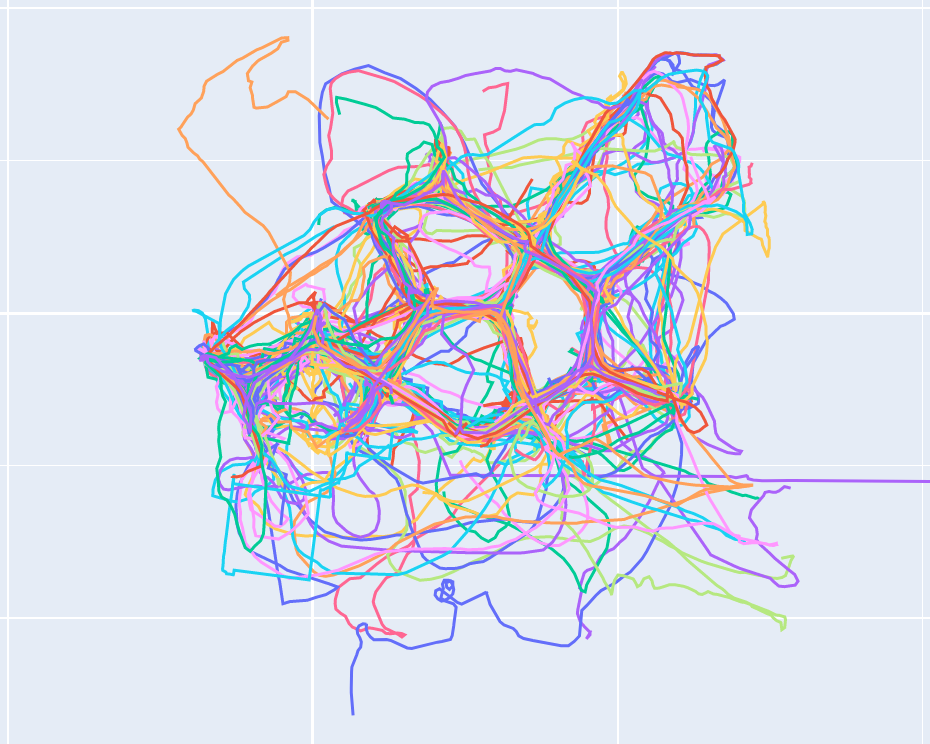

# ExplorationMeasures
This is the repository for Baumann et al.: "Towards a characterization of human spatial exploration behavior" (unpublished). For background information on the dataset, please see [Schomaker et al., (2022). *Effects of exploring a novel environment on memory across the lifespan*](https://www.nature.com/articles/s41598-022-20562-4).

## Repository structure
- *position_data* contains the raw trajectories (as .csv files) for each subject, indexed by subject identifier and exposition (i.e., *500_1.csv* represents the trajectory for subject 500). Note that while the original dataset contained two rounds of exploration, we here only use data from the first exploration round. All trajectories were recorded in three dimensions (order of columns: x,y,z) Note that trajectories do not contain timestamps (see publication for more details and how trajectories were resampled to a common sampling rate).
- *person_data* contains a SPSS dataset (*person_data.sav*) with the corresponding subject information (age, sex, envrionment type, novelty seeking score)
- *object_data* contains two .csv files with object coordinates for each of the two virtual environments ("green" or "pink") 
- *feature_extraction* contains the Python code used for the extraction of exploration measures as well as for all plots showing raw trajectories
- *flight_data* contains numpy files with all trajectories resampled to the flight scale following the same indexing order as detailed above(i.e., *500_1_flight.csv* represents the flight scaled trajectory for subject 500)
- *analysis* contains the R code used for hierarchical clustering and statistical models and all plots related to the analysis
- *output_data* contains output data from feature extraction and plotting

CAVE: note that the code uses relative paths to access the different directories, which may only work on Windows machines. If any errors occur, please specify direct paths.

## Feature extraction (Python)
- *main.py* contains the main script, *readData.py* all functions for reading the trajectories and subject dataframe, *staticticalMeasures.py* contains the functions to compute the different measures, *visuals.py* contains plotting functions
- input data: trajectories are read from .csv files and stored in a list of numpy arrays (*path_data*). The dataframe containing is read from a .sav (SPSS) file and stored as a Pandas dataframe (*person_data*)
- output data: all measures are added to the *person_data* table, which is printed as .csv table to the *output_data* folder

### Exploration measures in *statisticalMeasures.py*
All Exploration measures can be applied either to a single trajectory (indicated by the key word *compute*: i.e., *computePathLength()*) as well as to a group of trajectories (indicated by the key word *get*: i.e., *getPathLength()*)

Functions are available for the following measures:
- Path Length
- Pausing
- Area Covered
- Roaming Entropy
- Sinuosity
- Fractal Dimension
- Revisiting
- Turnarounds
- Flight Turnarounds
- Landmark Visits
- Landmark Revisits
- Exploration Efficiency 
- Object Efficiency

## Analysis (R)
- includes checks for subject exclusion 
- includes hierarchical clustering analysis
- includes novelty seeing analysis

## Contact
For further information please contact Valentin Baumann
valentin(dot)baumann(at)med(dot)ovgu(dot)de or valentin(dot)adrian(dot)baumann(at)gmail(dot)com

## A note on other movement analysis packages 
Note that for some measures we adapted or directly call code from two already published software packages, *[trajr]*(https://onlinelibrary.wiley.com/doi/10.1111/eth.12739) and *[traja]*(https://joss.theoj.org/papers/10.21105/joss.03202). If possible, we crossvalidated results between packages to ensure correct computation of features. 